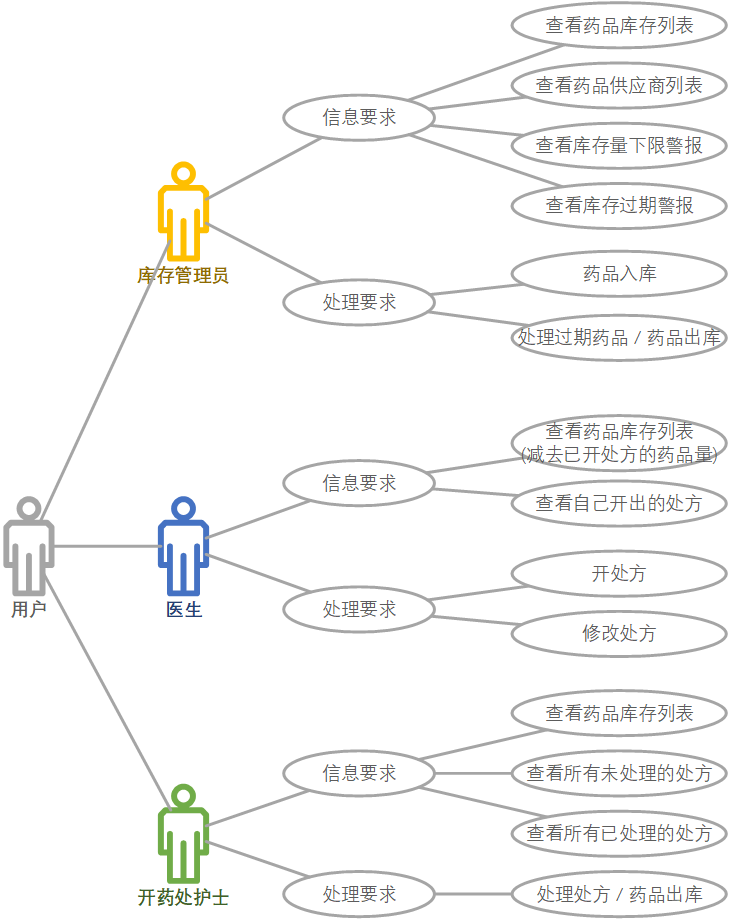

# DIMS  

数据库系统原理课程设计，DIMS，Drug Inventory Management System，基于 SSM 框架的医院药品管理系统。  

## 任务进度  

- [ ] [0. 本组成员任务分工](#本组成员任务分工)  
- [ ] [1. 数据库设计](#数据库设计)  
	- [ ] [1.1 需求分析](#需求分析)  
	- [ ] [1.2 概念结构设计](#概念结构设计)  
	- [ ] [1.3 逻辑结构设计](#逻辑结构设计)  
	- [ ] [1.4 物理结构设计](#物理结构设计)  
	- [ ] [1.5 数据库实施](#数据库实施)  
	- [ ] [1.6 数据库运行和维护](#数据库运行和维护)  
- [ ] [2. 应用系统设计](#应用系统设计)  
	- [ ] [2.0 环境准备](#环境准备)  
		- [ ] [2.0.1 配置 Java 环境](#配置-Java-环境)  
		- [ ] [2.0.2 安装 Eclipse IDE for Enterprise Java Developers](#安装-Eclipse-IDE-for-Enterprise-Java-Developers)  
		- [ ] [2.0.3 配置 Tomcat 环境](#配置-Tomcat-环境)  
		- [ ] [2.0.4 在 Eclipse 中配置 Tomcat Server](#在-Eclipse-中配置-Tomcat-Server)  
	- [ ] [2.1 创建一个新的 Dynamic Web 项目](#创建一个新的-Dynamic-Web-项目)  
	- [ ] [2.2 集成 Spring 和 Sping MVC]()  
		- [ ] [2.2.1 导入 Spring 的 jar 包]()  
		- [ ] [2.2.2 导入 Spring MVC 的 jar 包]()  
		- [ ] [2.2.3 配置 Spring]()  
		- [ ] [2.2.4 配置 Spring MVC]()  
	- [ ] [2.3 配置 web.xml]()  
	- [ ] [2.4 集成 MyBatis](#集成-MyBatis)  
		- [ ] [2.4.1 导入 MyBatis 的 jar 包]()  
		- [ ] [2.4.2 配置 MyBatis](#配置-MyBatis)  
	- [ ] [2.5 集成 log4j](#集成-log4j)  
	- [ ] [2.6 集成 Bootstrap]()  

## 本组成员任务分工  

## 数据库设计  

在数据库设计过程中，需求分析和概念结构设计可以独立于任何数据库管理系统进行，逻辑结构设计和物理结构设计与选用的数据库管理系统密切相关。  

### 需求分析  

需求分析必须准确了解与分析用户需求 (包括数据与处理)。  

**设计描述**：数字字典、全系统中数据项、数据结构、数据流、数据存储的描述。  

**任务**：通过详细调查现实世界要处理的对象 (组织、部门、企业等)，充分了解原系统 (手工系统或计算机系统) 的工作概况，明确用户的各种需求，然后在此基础上确定新系统的功能。新系统必须充分考虑今后可能的扩充和改变，不能仅仅按当前应用需求来设计数据库。调查的重点是 **“数据”** 和 **“处理”**，通过调查、收集与分析，获得用户对数据库的如下要求：  

* **信息要求**：指用户需要从数据库中获得信息的内容与性质。由信息要求可以导出数据要求，即在数据库中需要存储哪些数据。  
* **处理要求**：指用户要完成的数据处理功能，对处理性能的要求。  
* **安全性与完整性要求**  

  

数字字典：

全系统中数据项：

数据结构：

数据流：

数据存储的描述：

### 概念结构设计  

概念结构设计通过对用户需求进行综合、归纳与抽象，形成一个独立于具体数据库管理系统的概念模型。  

**设计描述**：概念模型 (E-R 图)、数据字典。  

**任务**：概念结构设计的第一步就是对需求分析阶段收集到的数据进行分类、组织，确定实体、实体的属性、实体之间的联系类型，形成 E-R 图。  

  

  

### 逻辑结构设计  

逻辑结构设计是将概念结构转换为某个数据库管理系统所支持的数据模型，并对其进行优化。  

**设计描述**：某种数据模型 (关系 / 非关系)。  

**任务**：把概念结构设计阶段设计好的基本 E-R 图转换为与选用数据库管理系统产品所支持的数据模型相符合的逻辑结构。将概念模型转换为全局逻辑模型后，还应该根据局部应用需求，结合具体关系数据库管理系统的特点设计用户的外模式。  

### 物理结构设计  

物理结构设计是为逻辑数据模型选取一个最适合应用环境的物理结构 (包括存储结构和存取方法)。  

**设计描述**：存储安排、存取方法选择、存取路径建立。  

### 数据库实施  

在数据库实施阶段，设计人员运用数据库管理系统提供的数据库语言及其宿主语言，根据逻辑设计和物理设计的结果建立数据库，编写与调试应用程序，组织数据入库，并进行试运行。  

**设计描述**：创建数据库模式、装入数据、数据库试运行。  

* [preDB.sql](./preDB.sql)  
* [testDB.sql](./testDB.sql)  

### 数据库运行和维护  

**设计描述**：性能监测、转储 / 恢复、数据库重组和重构。  

## 应用系统设计  

### 环境准备  

#### 配置 Java 环境  

1. 下载 JDK 安装包：
   * [Java SE 官网](https://www.oracle.com/technetwork/java/javase/overview/index.html)  
   * [Java SE 官网下载页面](https://www.oracle.com/technetwork/java/javase/downloads/index.html)  
2. 配置环境变量：  

	| 变量 | 值 |
	| --- | --- |
	| JAVA_HOME | C:\Program Files\Java\jdk1.8.0_231 |
	| JRE_HOME | C:\Program Files\Java\jre1.8.0_231 |
	| Path | ;%JAVA_HOME%\bin |

#### 安装 Eclipse IDE for Enterprise Java Developers  

* [Eclipse 官网](https://www.eclipse.org/)  
* [Eclipse 官网下载页面](https://www.eclipse.org/downloads/)  

#### 配置 Tomcat 环境  

1. 从官网下载相应的 Tomcat Binary Distributions 安装包文件 `32-bit/64-bit Windows Service Installer`。  
	* [Tomcat 官网](http://tomcat.apache.org/)  
	* [Tomcat 9 官网下载页面](https://tomcat.apache.org/download-90.cgi)  
2. 双击运行下载的安装文件，按照提示一步一步安装并配置。  
3. 配置环境变量：  

	| 变量 | 值 |
	| --- | --- |
	| TOMCAT_HOME | C:\Program Files\Apache Software Foundation\Tomcat 9.0 |
	| CATALINA_HOME | C:\Program Files\Apache Software Foundation\Tomcat 9.0 |
	| Path | ;%TOMCAT_HOME%\bin;%CATALINA_HOME%\lib |

#### 在 Eclipse 中配置 Tomcat Server  

参考：  
* [Eclipse 配置 Tomcat9](https://blog.csdn.net/weixin_44436561/article/details/86300115)  
* [安装 Eclipse，配置 Tomcat](https://www.cnblogs.com/greenteaone/p/7929571.html)  
* [Eclipse 环境下如何配置 Tomcat，并且把项目部署到 Tomcat 服务器上](https://blog.csdn.net/yerenyuan_pku/article/details/51830104)  
* [Eclipse 环境下如何配置 Tomcat，并且把项目部署到 Tomcat 服务器上](https://blog.csdn.net/weixin_41704733/article/details/79871950)  

### 创建一个新的 Dynamic Web 项目  

新建一个名为 `DIMS` 的 `Dynamic Web Project`，`Target runtime` 选择上一步在 Eclipse 当中配置的 `Apache Tomcat v9.0`，`Dynamic web module version` 选择最新版本，`Configuration` 选择 `Default Configuration for Apache Tomcat v9.0`，其它选项不作更改，点击 `Next`。  

将 `Default output folder` 的值改为 `WebContent\WEB-INF\classes`，点击 `Next`。  

勾选 `Generate web.xml deployment descriptor`，点击 `Finish`。  

### 集成 Spring 和 Sping MVC  

#### 导入 Spring 的 jar 包  

#### 导入 Spring MVC 的 jar 包  

#### 配置 Spring  

#### 配置 Spring MVC  

### 配置 web.xml  

### 集成 MyBatis  

#### 导入 MyBatis 的 jar 包  

#### 配置 MyBatis  

### 集成 log4j  

### 集成 Bootstrap  
