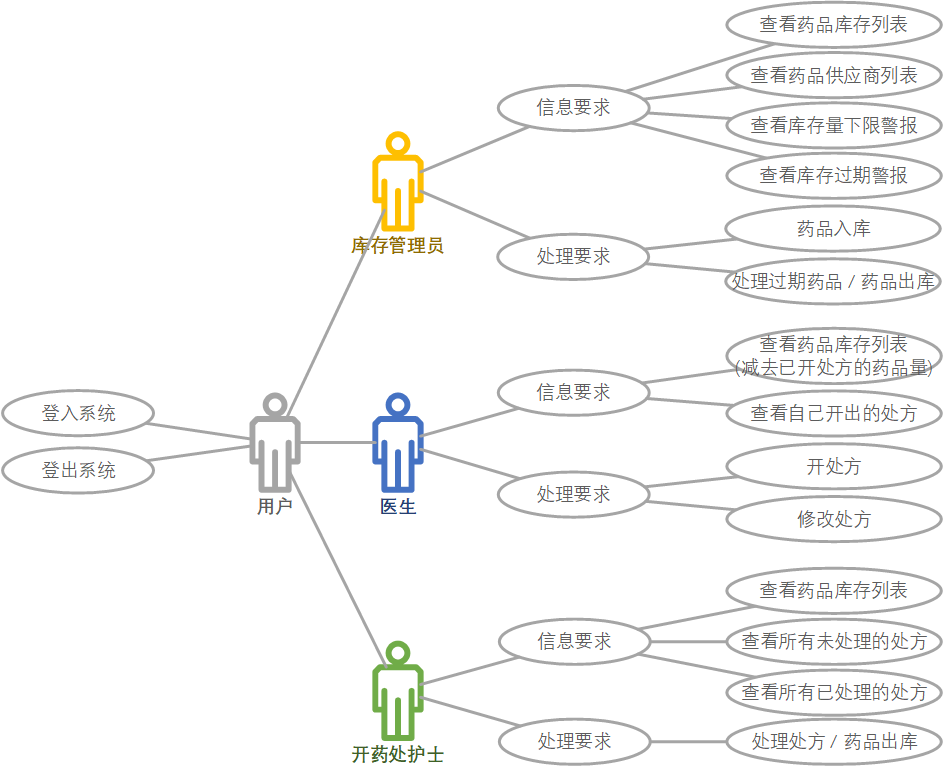
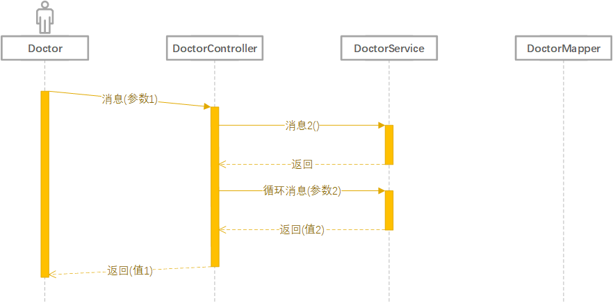
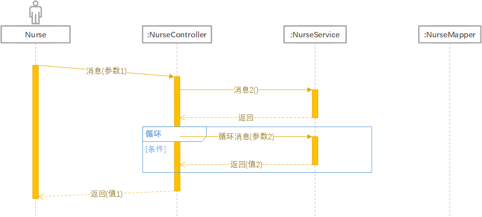

# DIMS  


数据库系统原理课程设计，DIMS，Drug Inventory Management System，基于 SSM 框架的医院药品管理系统。  

## 任务进度  

- [ ] [0. 本组成员任务分工](#本组成员任务分工)  
- [ ] [1. 数据库设计](#数据库设计)  
	- [ ] [1.1 需求分析](#需求分析)  
	- [ ] [1.2 概念结构设计](#概念结构设计)  
	- [ ] [1.3 逻辑结构设计](#逻辑结构设计)  
	- [ ] [1.4 物理结构设计](#物理结构设计)  
	- [ ] [1.5 数据库实施](#数据库实施)  
	- [ ] [1.6 数据库运行和维护](#数据库运行和维护)  
- [ ] [2. 应用系统设计](#应用系统设计)  
	- [ ] [2.0 环境准备](#环境准备)  
		- [ ] [2.0.1 配置 Java 环境](#配置-Java-环境)  
		- [ ] [2.0.2 安装 Eclipse IDE for Enterprise Java Developers](#安装-Eclipse-IDE-for-Enterprise-Java-Developers)  
		- [ ] [2.0.3 配置 Tomcat 环境](#配置-Tomcat-环境)  
		- [ ] [2.0.4 在 Eclipse 中配置 Tomcat Server](#在-Eclipse-中配置-Tomcat-Server)  
	- [ ] [2.1 创建一个新的 Dynamic Web 项目](#创建一个新的-Dynamic-Web-项目)  
	- [ ] [2.2 集成 Spring 和 SpingMVC](#集成-Spring-和-SpingMVC)  
		- [ ] [2.2.1 导入 Spring 的 jar 包](#导入-Spring-的-jar-包)  
		- [ ] [2.2.2 导入 SpringMVC 的 jar 包](#导入-SpringMVC-的-jar-包)  
		- [ ] [2.2.3 导入 Apache Commons 的 jar 包](#导入-Apache-Commons-的-jar-包)  
		- [ ] [2.2.4 导入其它基础 jar 包](#导入其它基础-jar-包)  
		- [ ] [2.2.5 配置 Spring](#配置-Spring)  
		- [ ] [2.2.6 配置 SpringMVC](#配置-SpringMVC)  
	- [ ] [2.3 配置 web.xml](#配置-web.xml)  
	- [ ] [2.4 集成 Spring 和 MyBatis](#集成-Spring-和-MyBatis)  
		- [ ] [2.4.1 导入 MyBatis 的 jar 包](#导入-MyBatis-的-jar-包)  
		- [ ] [2.4.2 配置 MyBatis](#配置-MyBatis)  
	- [ ] [2.5 配置 log4j](#配置-log4j)  
	- [ ] [2.6 集成基于 Bootstrap 前端框架的 ACE 管理系统页面模板](#集成基于-Bootstrap-前端框架的-ACE-管理系统页面模板)  
	- [ ] [2.7 详细设计阶段](#详细设计阶段)  

## 本组成员任务分工  

## 数据库设计  

在数据库设计过程中，需求分析和概念结构设计可以独立于任何数据库管理系统进行，逻辑结构设计和物理结构设计与选用的数据库管理系统密切相关。  

### 需求分析  

需求分析必须准确了解与分析用户需求 (包括数据与处理)。  

**设计描述**：数字字典、全系统中数据项、数据结构、数据流、数据存储的描述。  

**任务**：通过详细调查现实世界要处理的对象 (组织、部门、企业等)，充分了解原系统 (手工系统或计算机系统) 的工作概况，明确用户的各种需求，然后在此基础上确定新系统的功能。新系统必须充分考虑今后可能的扩充和改变，不能仅仅按当前应用需求来设计数据库。调查的重点是 **“数据”** 和 **“处理”**，通过调查、收集与分析，获得用户对数据库的如下要求：  

* **信息要求**：指用户需要从数据库中获得信息的内容与性质。由信息要求可以导出数据要求，即在数据库中需要存储哪些数据。  
* **处理要求**：指用户要完成的数据处理功能，对处理性能的要求。  
* **安全性与完整性要求**  

**业务用例图**：  

	  

	参考：  

	* [UML 之用例图](https://www.cnblogs.com/gd-luojialin/p/10356704.html)  

**数据字典**：数据字典是进行详细的数据收集和数据分析所获得的主要成果。它是关于数据库中数据的描述，即元数据，而不是数据本身。数据字典是在需求分析阶段建立，在数据库设计过程中不断修改、充实、完善的。它在数据库设计中占有很重要的地位。数据字典通常包括数据项、数据结构、数据流、数据存储和处理过程几部分。其中数据项是数据的最小组成单位，若干个数据项可以组成一个数据结构。数据字典通过对数据项和数据结构的定义来描述数据流、数据存储的逻辑内容。  

* **数据项**：数据项是不可再分的数据单位。对数据项的描述通常包括以下内容：  

```
数据项描述 = { 数据项名, 数据项含义说明, 别名, 数据类型, 长度, 取值范围, 取值含义, 与其他数据项的逻辑关系, 数据项之间的联系 }
```

* **数据结构**：

```
数据结构描述 = { 数据结构名, 含义说明, 组成:{数据项或数据结构} }
```

* **数据流**：

```
数据流描述 = { 数据流名, 说明, 数据流来源, 数据流去向, 组成:{数据结构}, 平均流量, 高峰期流量 }
```

* **数据存储**：

```
数据存储描述 = { 数据存储名, 说明, 编号, 输入的数据流, 输出的数据流, 组成:{数据结构}, 数据量, 存取频度, 存取方式 }
```

* **处理过程**：

```
处理过程描述 = { 处理过程名, 说明, 输入:{数据流}, 输出:{数据流}, 处理:{简要说明} }
```

### 概念结构设计  

概念结构设计通过对用户需求进行综合、归纳与抽象，形成一个独立于具体数据库管理系统的概念模型。  

**设计描述**：概念模型 (E-R 图)、数据字典。  

**任务**：概念结构设计的第一步就是对需求分析阶段收集到的数据进行分类、组织，确定实体、实体的属性、实体之间的联系类型，形成 E-R 图。  

  

### 逻辑结构设计  

逻辑结构设计是将概念结构转换为某个数据库管理系统所支持的数据模型，并对其进行优化。  

**设计描述**：某种数据模型 (关系 / 非关系)。  

**任务**：把概念结构设计阶段设计好的基本 E-R 图转换为与选用数据库管理系统产品所支持的数据模型相符合的逻辑结构。将概念模型转换为全局逻辑模型后，还应该根据局部应用需求，结合具体关系数据库管理系统的特点设计用户的外模式。  

**E-R 图向关系模型的转换**：  

1. 一个 1:1 联系可以转换为一个独立的关系模式，也可以与任意一端的关系模式合并。  
2. 一个 1:n 联系可以转换为一个独立的关系模式，也可以与 n 端对应的关系模式合并。  
3. 一个 m:n 联系转换为一个关系模式。  
4. 三个或三个以上实体间的一个多元联系可以转换为一个关系模式。  
5. 具有相同码的关系模式可以合并。  

  

### 物理结构设计  

物理结构设计是为逻辑数据模型选取一个最适合应用环境的物理结构 (包括存储结构和存取方法)。  

**设计描述**：存储安排、存取方法选择、存取路径建立。  

### 数据库实施  

在数据库实施阶段，设计人员运用数据库管理系统提供的数据库语言及其宿主语言，根据逻辑设计和物理设计的结果建立数据库，编写与调试应用程序，组织数据入库，并进行试运行。  

**设计描述**：创建数据库模式、装入数据、数据库试运行。  

* [preDB.sql](./preDB.sql)  
* [testDB.sql](./testDB.sql)  

### 数据库运行和维护  

**设计描述**：性能监测、转储 / 恢复、数据库重组和重构。  

## 应用系统设计  

参考：  

* [B/S、C/S 模式介绍](https://blog.csdn.net/wang404838334/article/details/78449164)  
* [SSM 框架介绍](https://blog.csdn.net/jack_xia_2018/article/details/83540199)  

### 环境准备  

#### 配置 Java 环境  

1. 下载 JDK 安装包：
   * [Java SE 官网](https://www.oracle.com/technetwork/java/javase/overview/index.html)  
   * [Java SE 官网下载页面](https://www.oracle.com/technetwork/java/javase/downloads/index.html)  
2. 配置环境变量：  

	| 变量 | 值 |
	| --- | --- |
	| JAVA_HOME | C:\Program Files\Java\jdk1.8.0_231 |
	| JRE_HOME | C:\Program Files\Java\jre1.8.0_231 |
	| Path | ;%JAVA_HOME%\bin |

#### 安装 Eclipse IDE for Enterprise Java Developers  

* [Eclipse 官网](https://www.eclipse.org/)  
* [Eclipse 官网 Installer 下载页面](https://www.eclipse.org/downloads/)  

#### 配置 Tomcat 环境  

1. 从官网下载相应的 Tomcat Binary Distributions 安装包文件 `32-bit/64-bit Windows Service Installer`。  
	* [Tomcat 官网](http://tomcat.apache.org/)  
	* [Tomcat 9 官网下载页面](https://tomcat.apache.org/download-90.cgi)  
2. 双击运行下载的安装文件，按照提示一步一步安装并配置。  
3. 配置环境变量：  

	| 变量 | 值 |
	| --- | --- |
	| TOMCAT_HOME | C:\Program Files\Apache Software Foundation\Tomcat 9.0 |
	| CATALINA_HOME | C:\Program Files\Apache Software Foundation\Tomcat 9.0 |
	| Path | ;%TOMCAT_HOME%\bin;%CATALINA_HOME%\lib |

#### 在 Eclipse 中配置 Tomcat Server  

参考：  

* [安装 Eclipse，配置 Tomcat](https://www.cnblogs.com/greenteaone/p/7929571.html)  
* [Eclipse 环境下如何配置 Tomcat，并且把项目部署到 Tomcat 服务器上](https://blog.csdn.net/weixin_41704733/article/details/79871950)  

### 创建一个新的 Dynamic Web 项目  

新建一个名为 `DIMS` 的 `Dynamic Web Project`，`Target runtime` 选择上一步在 Eclipse 当中配置的 `Apache Tomcat v9.0`，`Dynamic web module version` 选择最新版本，`Configuration` 选择 `Default Configuration for Apache Tomcat v9.0`，其它选项不作更改，点击 `Next`。  

将 `Default output folder` 的值改为 `WebContent\WEB-INF\classes`，点击 `Next`。  

勾选 `Generate web.xml deployment descriptor`，点击 `Finish`。  

测试项目是否可以发布成功，参考：  

* [Eclipse 环境下如何配置 Tomcat，并且把项目部署到 Tomcat 服务器上](https://blog.csdn.net/weixin_41704733/article/details/79871950)  

后续需要导入的 jar 包都复制到项目的 `WebContent\WEB-INF\lib` 目录当中来。  

### 集成 Spring 和 SpingMVC  

* [Spring 官网](https://spring.io/)  
* [Spring 发行版的下载地址](https://repo.spring.io/release/org/springframework/spring/)  
* [Spring 发行版 v5.2.1 的下载地址](https://repo.spring.io/release/org/springframework/spring/5.2.1.RELEASE/)  

下载 `spring-5.2.1.RELEASE-dist.zip` 并解压。  

#### 导入 Spring 的 jar 包  

将 `spring-5.2.1.RELEASE-dist.zip` 解压路径的 `libs` 目录下的一部分 jar 包复制到项目的 `WebContent\WEB-INF\lib` 目录当中来，需要的 jar 包如下：  

* spring-aop-5.2.1.RELEASE.jar  
* spring-aspects-5.2.1.RELEASE.jar  
* spring-beans-5.2.1.RELEASE.jar  
* spring-context-5.2.1.RELEASE.jar  
* spring-core-5.2.1.RELEASE.jar  
* spring-expression-5.2.1.RELEASE.jar  
* spring-jdbc-5.2.1.RELEASE.jar  
* spring-test-5.2.1.RELEASE.jar  
* spring-tx-5.2.1.RELEASE.jar  
* spring-web-5.2.1.RELEASE.jar  

#### 导入 SpringMVC 的 jar 包  

将 `spring-5.2.1.RELEASE-dist.zip` 解压路径的 `libs` 目录下的一部分 jar 包复制到项目的 `WebContent\WEB-INF\lib` 目录当中来，需要的 jar 包如下：  

* spring-webmvc-5.2.1.RELEASE.jar  

#### 导入 Apache Commons 的 jar 包  

* [Apache Commons 官网](https://commons.apache.org/index.html)  
* [Apache Commons 官网 jar 包下载地址](https://commons.apache.org/downloads/index.html)  

需要导入的 jar 包：  

* [commons-dbcp2-2.7.0.jar](https://commons.apache.org/proper/commons-dbcp/download_dbcp.cgi)  
* [commons-fileupload-1.4.jar](https://commons.apache.org/proper/commons-fileupload/download_fileupload.cgi)  
* [commons-io-2.6.jar](https://commons.apache.org/proper/commons-io/download_io.cgi)  
* [commons-logging-1.2.jar](https://commons.apache.org/proper/commons-logging/download_logging.cgi)  
* [commons-pool2-2.7.0.jar](https://commons.apache.org/proper/commons-pool/download_pool.cgi)  

参考：  

* [一篇关于 Apache Commons 类库的详解](https://blog.csdn.net/wiker_yong/article/details/23551209)  
* [Apache Commons 工具包](https://blog.csdn.net/qq_34520606/article/details/78431802)  

#### 导入其它基础 jar 包  

* [aspectjweaver-1.9.4.jar](https://mvnrepository.com/artifact/org.aspectj/aspectjweaver)  
* [com.springsource.org.aopalliance-1.0.0.jar](https://mvnrepository.com/artifact/org.aopalliance/com.springsource.org.aopalliance)  
* [jackson-annotations-2.10.0.jar](https://mvnrepository.com/artifact/com.fasterxml.jackson.core/jackson-annotations)  
* [jackson-core-2.10.0.jar](https://mvnrepository.com/artifact/com.fasterxml.jackson.core/jackson-core)  
* [jackson-databind-2.10.0.jar](https://mvnrepository.com/artifact/com.fasterxml.jackson.core/jackson-databind)  

参考：  

* [com.springsource.*.xx.jar 和同名 *.xx.jar 有什么区别？](https://blog.csdn.net/snower08/article/details/83353064)  

#### 配置 Spring  

在项目的 `Java Resources` 项中新建一个名为 `resource` 的 'source folder'，然后在其下新建两个 XML 文件。  

applicationContext.xml：  

```xml
<?xml version="1.0" encoding="UTF-8"?>
<beans xmlns="http://www.springframework.org/schema/beans"
       xmlns:context="http://www.springframework.org/schema/context"
       xmlns:xsi="http://www.w3.org/2001/XMLSchema-instance"
       xsi:schemaLocation="http://www.springframework.org/schema/beans
                           http://www.springframework.org/schema/beans/spring-beans.xsd
                           http://www.springframework.org/schema/context
                           http://www.springframework.org/schema/context/spring-context.xsd">
</beans>
```

#### 配置 SpringMVC  

applicationContext-mvc.xml：  

```xml
<?xml version="1.0" encoding="UTF-8"?>
<beans xmlns="http://www.springframework.org/schema/beans"
       xmlns:mvc="http://www.springframework.org/schema/mvc"
       xmlns:context="http://www.springframework.org/schema/context"
       xmlns:xsi="http://www.w3.org/2001/XMLSchema-instance"
       xsi:schemaLocation="http://www.springframework.org/schema/beans
                           http://www.springframework.org/schema/beans/spring-beans.xsd
                           http://www.springframework.org/schema/context
                           http://www.springframework.org/schema/context/spring-context.xsd
                           http://www.springframework.org/schema/mvc
                           http://www.springframework.org/schema/mvc/spring-mvc.xsd">
	<!-- mvc 静态资源放行 —— 允许访问图片等静态资源 -->
	<mvc:default-servlet-handler/>
	
	<!-- mvc 支持注解 Controller -->
	<context:annotation-config/>
	<mvc:annotation-driven/>
	
	<!-- 设置扫描包的路径 Controller -->
	<context:component-scan base-package="com.dims.web.controller"/>
	
	<!-- 视图解析器 -->
	<bean class="org.springframework.web.servlet.view.InternalResourceViewResolver">
		<!-- 配置前缀和后缀 -->
		<property name="prefix">
			<value>/WEB-INF/views/</value>
		</property>
		<property name="suffix">
			<value>.jsp</value>
		</property>
	</bean>
	
	<!-- 文件上传配置 -->
	<bean id="multipartResolver" class="org.springframework.web.multipart.commons.CommonsMultipartResolver">
		<!-- 最大值配置 -->
		<property name="maxUploadSize">
			<value>200000</value>
		</property>
	</bean>
</beans>
```

### 配置 web.xml  

在项目的 `WebContent\WEB-INF\` 目录下找到 web.xml 文件，进行配置：  

web.xml：  

```xml
<?xml version="1.0" encoding="UTF-8"?>
<web-app xmlns:xsi="http://www.w3.org/2001/XMLSchema-instance"
         xmlns="http://xmlns.jcp.org/xml/ns/javaee"
         xsi:schemaLocation="http://xmlns.jcp.org/xml/ns/javaee
                             http://xmlns.jcp.org/xml/ns/javaee/web-app_4_0.xsd"
         id="WebApp_ID" version="4.0">
	<display-name>DIMS</display-name>
	<welcome-file-list>
		<welcome-file>index.jsp</welcome-file>
	</welcome-file-list>
	
	<!-- 解决乱码问题 -->
	<filter>
		<filter-name>CharacterEncodingFilter</filter-name>
		<filter-class>org.springframework.web.filter.CharacterEncodingFilter</filter-class>
		<init-param>
			<param-name>encoding</param-name>
			<param-value>utf-8</param-value>
		</init-param>
	</filter>
	
	<filter-mapping>
		<filter-name>CharacterEncodingFilter</filter-name>
		<url-pattern>/*</url-pattern>
	</filter-mapping>
	
	<!-- 加载 spring 配置文件 -->
	<context-param>
		<param-name>contextConfigLocation</param-name>
		<param-value>classpath:applicationContext.xml</param-value>
	</context-param>
	
	<!-- 启动的时候加载 spring 的配置文件 -->
	<listener>
		<listener-class>org.springframework.web.context.ContextLoaderListener</listener-class>
	</listener>
	
	<!-- 启动的时候加载 springmvc 的配置文件 -->
	<servlet>
		<servlet-name>springmvc</servlet-name>
		<servlet-class>org.springframework.web.servlet.DispatcherServlet</servlet-class>
		<init-param>
			<param-name>contextConfigLocation</param-name>
			<param-value>classpath:applicationContext-mvc.xml</param-value>
		</init-param>
		<load-on-startup>1</load-on-startup>
	</servlet>
	
	<servlet-mapping>
		<servlet-name>springmvc</servlet-name>
		<url-pattern>/</url-pattern>
	</servlet-mapping>
</web-app>
```

### 集成 Spring 和 MyBatis  

#### 导入 MyBatis 的 jar 包  

* [MyBatis 官网](https://blog.mybatis.org/)  
* [MyBatis v3 官网](https://mybatis.org/mybatis-3/zh/index.html)  
* [MyBatis v3 GitHub 项目](https://github.com/mybatis/mybatis-3/)  
* [MyBatis-Spring 官网](http://mybatis.org/spring/zh/index.html)  

* [MyBatis v3 GitHub 项目 jar 包下载页面](https://github.com/mybatis/mybatis-3/releases)  
* [MyBatis-Spring jar 包下载页面](https://mvnrepository.com/artifact/org.mybatis/mybatis-spring/2.0.3)  

需要导入的 jar 包：  

* asm-7.0.jar  
* cglib-3.2.10.jar  
* javassist-3.24.1-GA.jar  
* log4j-1.2.17.jar  
* mybatis-3.5.3.jar  
* mybatis-spring-2.0.3.jar  
* slf4j-api-1.7.26.jar  
* slf4j-log4j12-1.7.26.jar  

除此之外还需要导入 SQL Server 的 JDBC Driver jar 包：  

* [mssql-jdbc-7.4.1.jre8.jar](https://docs.microsoft.com/en-us/sql/connect/jdbc/download-microsoft-jdbc-driver-for-sql-server?view=sql-server-ver15)  

#### 配置 MyBatis  

在 `resource` 目录下，新建一个名为 `jdbc.properties` 的文件：  

jdbc.properties：  

```
jdbc.driverClassName=com.microsoft.sqlserver.jdbc.SQLServerDriver
jdbc.url=jdbc:sqlserver://localhost:1433;databaseName=DIMS
jdbc.username=dba
jdbc.password=abcd1234@
```

在 Spring 的配置文件当中，配置 MyBatis：  

applicationContext.xml：  

```xml
<?xml version="1.0" encoding="UTF-8"?>
<beans xmlns="http://www.springframework.org/schema/beans"
       xmlns:context="http://www.springframework.org/schema/context"
       xmlns:xsi="http://www.w3.org/2001/XMLSchema-instance"
       xsi:schemaLocation="http://www.springframework.org/schema/beans
                           http://www.springframework.org/schema/beans/spring-beans.xsd
                           http://www.springframework.org/schema/context
                           http://www.springframework.org/schema/context/spring-context.xsd">
	<!-- jdbc.properties → dataSource → sqlSessionFactory → mapper → service → action -->
	
	<!-- jdbc.properties 加载 JDBC 配置文件 -->
	<context:property-placeholder location="classpath:jdbc.properties" />
	
	<!-- dataSource 配置数据源 (连接池) -->
	<bean id="dataSource" class="org.apache.commons.dbcp2.BasicDataSource" destroy-method="close">
		<!-- 依赖注入连接池需要的属性 -->
		<property name="driverClassName" value="${jdbc.driverClassName}" />
		<property name="url" value="${jdbc.url}" />
		<property name="username" value="${jdbc.username}" />
		<property name="password" value="${jdbc.password}" />
	</bean>
	
	<!-- sqlSessionFactory -->
	<bean id="sqlSessionFactory" class="org.mybatis.spring.SqlSessionFactoryBean">
		<!-- 引入数据源 -->
		<property name="dataSource" ref="dataSource" />
		<!-- 加载所有的 mapper 路径 -->
		<property name="mapperLocations" value="classpath:com/dims/mapper/*Mapper.xml" />
		<!-- 配置别名 -->
		<property name="typeAliasesPackage" value="com.dims.domain" />
	</bean>
	
	<!-- 扫描 mapper 层 -->
	<bean class="org.mybatis.spring.mapper.MapperScannerConfigurer">
		<!-- 扫描 mapper 接口的包路径 -->
		<property name="basePackage" value="com.dims.mapper" />
	</bean>
	
	<!-- 扫描 service 层 -->
	<context:component-scan base-package="com.dims.service" />
	
	<!-- action -->
</beans>
```

### 配置 log4j  

在 `resource` 目录下，新建一个名为 `log4j.properties` 的文件：  

log4j.properties：  

```
log4j.rootLogger=ERROR, stdout

log4j.logger.com.sms=TRACE

log4j.appender.stdout=org.apache.log4j.ConsoleAppender
log4j.appender.stdout.layout=org.apache.log4j.PatternLayout
log4j.appender.stdout.layout.ConversionPattern=%d %p [%c] - %m%n
```

### 集成基于 Bootstrap 前端框架的 ACE 管理系统页面模板  

* [ACE 管理系统页面模板预览](http://ace.jeka.by/)  
* [ACE GitHub 项目](https://github.com/bopoda/ace)  
* [ACE GitHub 项目 (中文版)](https://github.com/XinLiangCoder/AceAdmin)  

从 ACE 的 GitHub 项目页面下载该项目的压缩包，解压后将解压路径下的 `assets` 文件夹复制到项目的 `WebContent` 目录下。  

### 详细设计阶段  

  

  

  

  

参考：  

* [UML 之时序图](https://www.cnblogs.com/gd-luojialin/p/10356740.html)  
